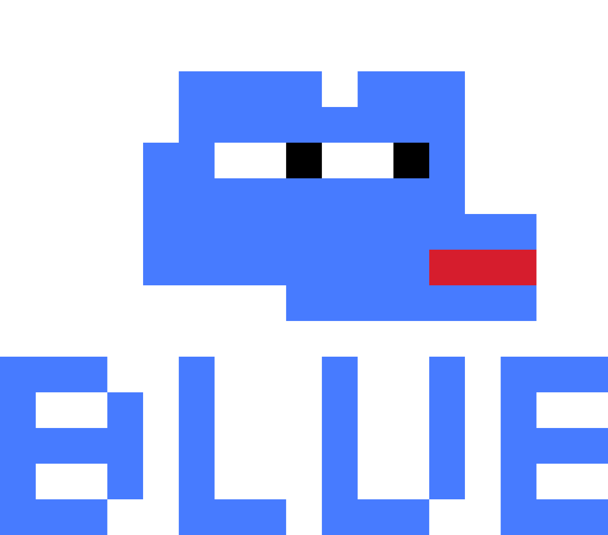

# Blue Bull - PVP Retro Arcade

## Overview
A lightweight web3 pvp arcade game library hosting multiple games including:
- BLUE PILL
- BULL RUN

## Core Features

### Authentication
- Web3 wallet connection required
- EVM/Solana signatures required for game creation/joining
- Signatures stored and verified in Redis
- Anti-cheat system via frontend in-game validation and post-game replay / settlement

### Main Lobby
Display features:
- Game listing table showing:
  - Game name
  - Game type (BLUE PILL/BULL RUN)
  - Player count (current/max)
  - Configuration (map size, game speed, etc)
  - Stakes (free-to-play or entry fee)
  - Creation timestamp
- Global chat system
- Create Game button (top right)
- Active games filter/search

### Game-Specific Lobby
- Dedicated chat room for players
- Game configuration display
- Player list
- Ready/start system
- Stakes display and handling

### Game States
1. Pending (visible in main lobby)
2. Ongoing (hidden by default)
3. Finished (archived)
4. Cancelled

### Communication Architecture
1. Out-of-game:
   - Server-client WebSocket communication
   - Lobby state updates
   - Chat messages
2. In-game:
   - P2P WebRTC communication between players
   - Server only maintains game status

### Data Storage (Redis)
See [models (Game, Protocol, IRC, Player)](./common/types) for exhaustive persistence schema
1. Lobby State:
   - Active games
   - Game configurations
   - Player counts
2. User Data:
   - Wallet addresses
   - Game signatures
   - Win/loss statistics
3. Game History:
   - Completed games
   - Winners/losers
   - Duration
   - Stakes/payouts
4. Chat History:
   - Global chat
   - Game-specific chat rooms

### Game Economics
- Free-to-play option (stakeless), still requires a Web3 signature/wallet to play
- Stake-based games:
  - Entry fee collection
  - Winner payout system
  - Platform fee handling

### Security
- Signature verification for chat/game actions (create/join as non observer/send state updates)
- P2P state validation (using game specific RTC channels)
- Frontend in-game anti-cheat
- Back-end post-game anti-cheat 
- Secured stake handling with delayed game outcome settlement base on the above

## Technical Stack

### Frontend
- Vue 3 
- Pug templating
- Tailwind CSS
- Phaser.js for game rendering
- Web3Modal for wallet connections
- WebRTC for P2P game state communication

### Backend
- Bun web server
- WebSocket server for:
  - WebRTC signaling
  - Lobby state management
  - Chat functionality
- Redis for persistent storage

## Development Phases
1. Basic lobby system with authentication
2. IRC implementation (Lobby + Game room, by default players are observers, require login/signature for sending messages)
3. Game creation and joining (by default players are observers, require login/signature for playing even f2p)
4. P2P game state management (Use of game specific WebRTC channel for game state updates)
5. Settlement system (game state when changed to finished by a majority of players is updated/settled in the back)
6. Implement first game of the platform: Snuke (see [description here](https://github.com/solrace-wtf/v1) for more details, multiplayer snake game inspired by Slither.io/Tron)
7. Back-end anti-cheat system (replay of games in the back-end using game state history similarly to Dookey Dash)
8. Front-end anti-cheat system (validation of game state updates following specific, obfuscated rules for each game)
9. Game economics, on-chain staking (staking contract with stake-in, stake-out and settlement methods)
